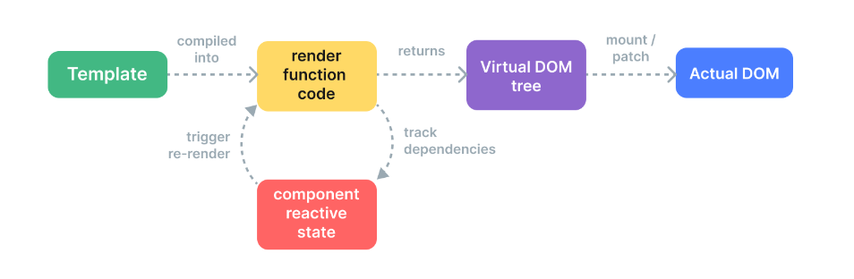

<!--
 * @Description: 
 * @Author: 曹俊
 * @Date: 2022-07-13 16:40:51
 * @LastEditors: 曹俊
 * @LastEditTime: 2022-07-13 19:21:35
-->
# 渲染机制

#### Vue 是如何将一份模板转换为真实的 DOM 节点的呢？又是如何高效地更新 DOM 节点的呢？我们接下来就将尝试通过深入研究 Vue 的内部渲染机制来解释这些问题。

# 虚拟 DOM

#### 虚拟 DOM(VDOM) 是一种编程概念，意为将将目标所需的 UI 通过数据结构“虚拟”地表示出来，保存在内存中，并与真实的 DOM 保持同步。这个概念是由 React 率先开拓，随后在各个不同的框架中都有不同的实现，当然也包括 Vue。

```js
const vnode = {
  type: 'div',
  props: {
    id: 'hello'
  },
  children: [
    /* 更多 vnode */
  ]
}
```

#### 这里所说的 vnode 即一个纯 JavaScript 的对象 (一个“虚拟节点”)，它代表着一个 div 元素。它包含我们创建实际元素所需的所有信息。它还包含更多的子节点，这使它成为虚拟 DOM 树的根节点。

#### 一个运行时渲染器将会遍历整个虚拟 DOM 树，并据此构建真实的 DOM 树。这个过程被称为挂载 (mount)。

#### 如果我们有两份虚拟 DOM 树，渲染器将会有比较地遍历它们，找出它们之间的区别，并应用这其中的变化到真实的 DOM 上。这个过程被称为修补 (patch)，又被称为“比较差异 (diffing)”或“协调 (reconciliation)”。

#### 虚拟 DOM 带来的主要收益是它赋予了开发者编程式地、声明式地创建、审查和组合所需 UI 结构的能力，而把直接与 DOM 相关的操作交给了渲染器。

# 渲染管线

### 以更高层面的视角看，Vue 组件挂载后发生了如下这几件事：

1. **编译**：Vue 模板被编译为了**渲染函数**：即用来返回虚拟 DOM 树的函数。这一步骤可以通过构建步骤提前完成，也可以通过使用运行时编译器即时完成。
2. **挂载**：运行时渲染器调用渲染函数，遍历返回的虚拟 DOM 树，并基于它创建实际的 DOM 节点。这一步会作为响应式副作用执行，因此它会追踪其中所用到的所有响应式依赖。
3. **修补**：当一个依赖发生变化后，副作用会重新运行，这时候会创建一个更新后的虚拟 DOM 树。运行时渲染器遍历这棵新树，将它与旧树进行比较，然后将必要的更新应用到真实 DOM 上去。



# 模板 vs. 渲染函数

#### Vue模板会被编译成虚拟DOM渲染函数，Vue也提供了API使我们可以不使用模板编译，直接手写渲染函数，在处理高度动态的逻辑时，渲染函数比模板更加灵活，因为你可以完全地使用JavaScript来构造你想要的Vnode。

### 那么为什么 Vue 默认推荐使用模板呢？有以下几点原因：

1. 模板更贴近实际的 HTML。这使得我们能够更方便地重用一些已有的 HTML 代码片段，能够带来更好的可访问性体验、能更方便地使用 CSS 应用样式，并且更容易使设计师理解和修改。
2. 由于其确定的语法，更容易对模板做静态分析。这使得 Vue 的模板编译器能够应用许多编译时优化来提升虚拟 DOM 的性能表现 (下面我们将展开讨论)。

#### 在实践中，模板对大多数的应用场景都是够用且高效的。渲染函数一般只会在需要处理高度动态渲染逻辑的可重用组件中使用。想了解渲染函数的更多使用细节可以去到渲染函数 & JSX 章节继续阅读。

# 带编译时信息的虚拟 DOM

#### 虚拟 DOM 在 React 和大多数其他实现中都是纯运行时的：协调算法无法预知新的虚拟 DOM 树会是怎样，因此它总是需要遍历整棵树、比较每个 vnode 上 props 的区别来确保正确性。另外，即使一棵树的某个部分从未改变，还是会在每次重渲染时创建新的 vnode，带来了完全不必要的内存压力。这也是虚拟 DOM 最受诟病的地方之一：这种有点暴力的协调过程通过牺牲效率来换取可声明性和正确性。

#### 但实际上我们并不需要这样。在 Vue 中，框架同时控制着编译器和运行时。这使得我们可以为紧密耦合的模板渲染器应用许多编译时优化。编译器可以静态分析模板并在生成的代码中留下标记，使得运行时尽可能地走捷径。与此同时，我们仍旧保留了边界情况时用户想要使用底层渲染函数的能力。我们称这种混合解决方案为带编译时信息的虚拟 DOM。

### 下面，我们将讨论一些 Vue 编译器用来提高虚拟 DOM 运行时性能的主要优化：

**静态提升**

#### 在模板中常常有部分内容是不带任何动态绑定的：

```html
<div>
  <div>foo</div> <!-- 需提升 -->
  <div>bar</div> <!-- 需提升 -->
  <div>{{ dynamic }}</div>
</div>
```

#### foo 和 bar 这两个 div 是完全静态的，没有必要在重新渲染时再次创建和比对它们。Vue 编译器自动地会提升这部分 vnode 创建函数到这个模板的渲染函数之外，并在每次渲染时都使用这份相同的 vnode，渲染器知道新旧 vnode 在这部分是完全相同的，所以会完全跳过对它们的差异比对。

#### 此外，当有足够多连续的静态元素时，它们还会再被压缩为一个“静态 vnode”，其中包含的是这些节点相应的纯 HTML 字符串。(示例)。这些静态节点会直接通过 innerHTML 来挂载。同时还会在初次挂载后缓存相应的 DOM 节点。如果这部分内容在应用中其他地方被重用，那么将会使用原生的 cloneNode() 方法来克隆新的 DOM 节点，这会非常高效。

# 修补标记 Flags

### 对于单个有动态绑定的元素来说，我们可以在编译时推断出大量信息：

```html
<!-- 仅含 class 绑定 -->
<div :class="{ active }"></div>

<!-- 仅含 id 和 value 绑定 -->
<input :id="id" :value="value">

<!-- 仅含文本子节点 -->
<div>{{ dynamic }}</div>
```

### 在为这些元素生成渲染函数时，Vue 在 vnode 创建调用中直接编码了每个元素所需的更新类型：

```js
createElementVNode("div", {
  class: _normalizeClass({ active: _ctx.active })
}, null, 2 /* CLASS */)
```